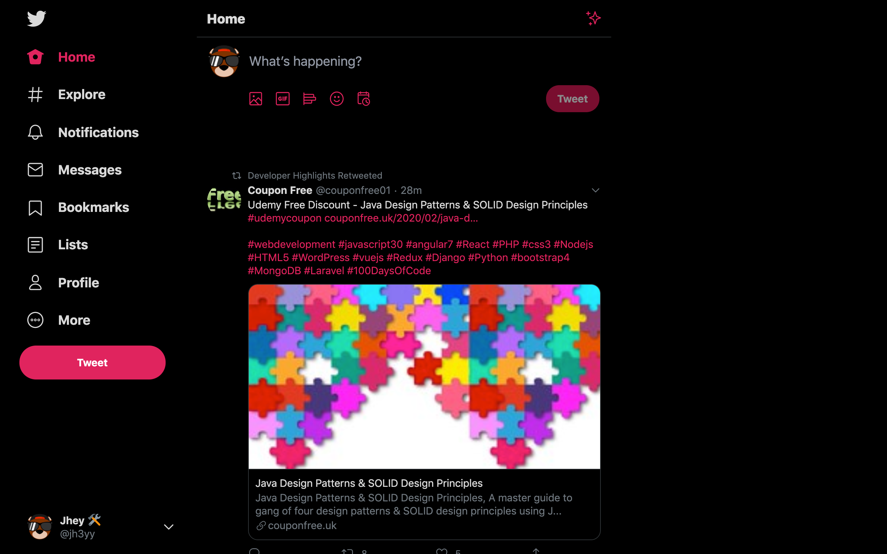
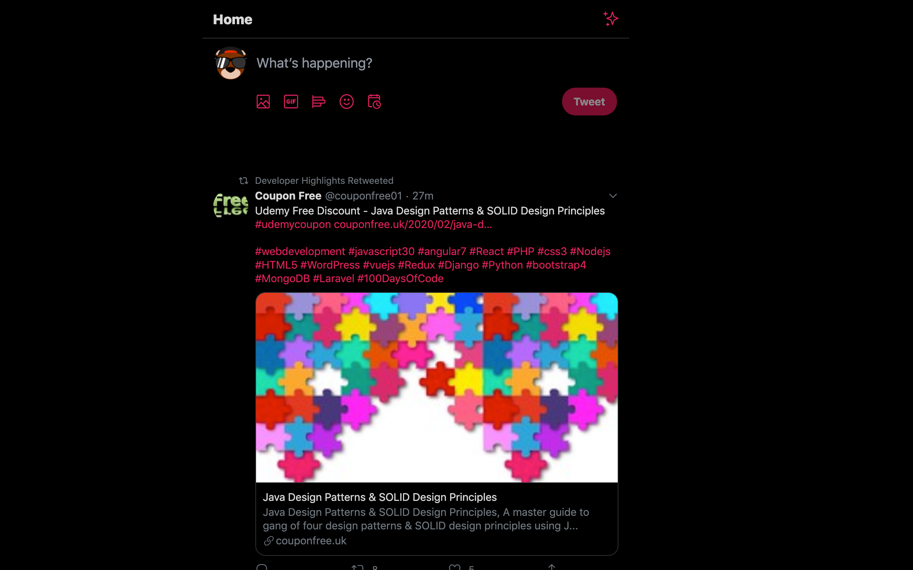
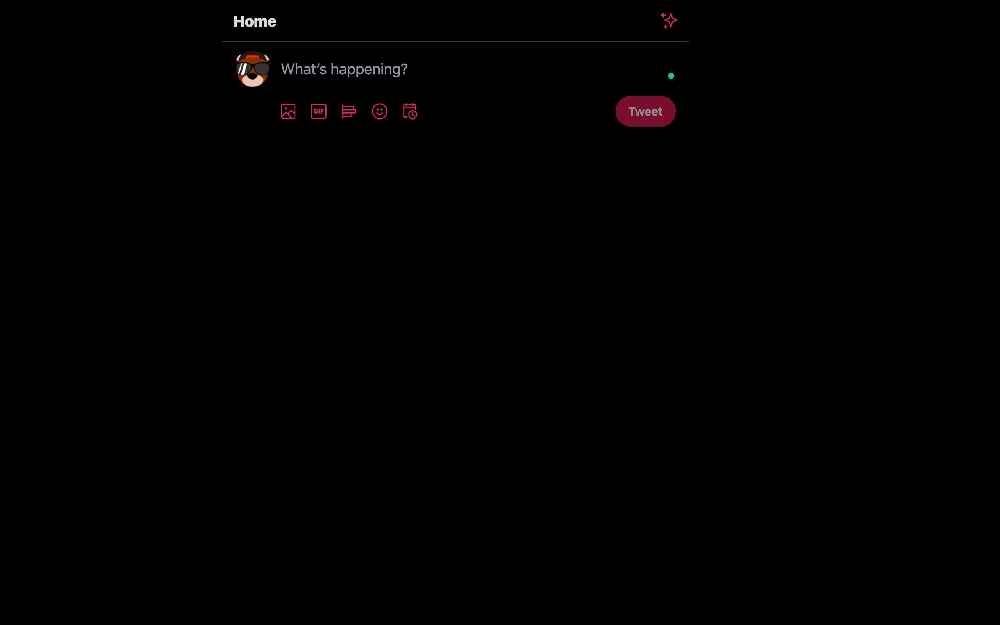

# Focussed Twitter 🐦

A browser extension for reducing the noise on Twitter 🙌
_Works in Firefox and Chromium_

- [Chrome Extension](https://chrome.google.com/webstore/detail/focussed-twitter/efldegaojlekkkoegoeakkgknaagjeoj)
- [Firefox Add-On](https://addons.mozilla.org/en-US/firefox/addon/focussed-twitter/)

## Motivation
With the new Twitter layout hitting our screens, some weren't too happy about the "noise".

FWIW, I don't mind the new layout. I've almost forgotten how the old one looked now 😂
However, the new one is a little noisy when scrolling.

Enter "Focussed Twitter"!

What started as a bookmarklet is now a browser extension!

## Principles + Concept
The idea for "Focussed Twitter" is to make it easier to focus on the tweets.

The original idea for better UX was that if I scrolled Twitter, I wanted everything else to fade away for a moment.

No need to remove elements or break the behavior/layout 👍

Everything that "Focussed Twitter" does can be switched off or configured to your liking in the extension options 💪

## Features
- Dim sides on scroll
- Set the dim
- Hide the sidebar
- Hide separators
- Remove tweet borders
- Increase the margin between tweets
- Permanently dim sides
- Focussed composing
- Hide metric counts
- Hide DMs drawer

## How does it work
`Focussed Twitter' is powered by CSS variables and MutationObserver. When an option is changed, the script updates inline CSS variables on the document.
These then do things like trigger opacity changes and update transition timings 🤓

## Contributions
I'd love some! ❤️ Any PRs are welcome or suggestions.

Ideas include:
- Creating a better icon 😅
- Porting to other browsers besides Firefox && Chrome
- Cleaner styling for the popup window 😅

The code is in a place where it's not too heavy. There is a reason for this. If Twitter decides to change the UI structure significantly at some point, the extension will need updating.

## Development
### Chrome
- Rename `manifest.chrome.json` to `manifest.json`.
- Load the unpacked extension into Chrome by pointing at the focussed twitter directory.
### Firefox
- Rename `manifest.firefox.dev.json` to `manifest.json`.
- Load the add on into Firefox by pointing at the manifest file.

---

Made in haste by @jh3y 😅