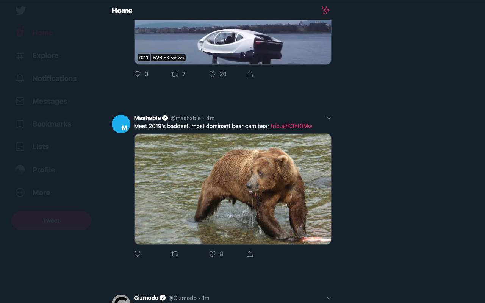

# Focussed Twitter 🐦

A browser extension for reducing the noise on Twitter 🙌

## Motivation
With the new Twitter layout hitting our screens, some aren't too happy about the "noise".

FWIW, I don't mind the new layout. I've almost forgotten how the old one looked now 😂
However, the new one is a little noisy when scrolling.

Enter "Focussed Twitter"!

What started as a bookmarklet is now a browser extension!

## Principles + Concept
The idea for "Focussed Twitter" is to make it easier to focus on the tweets.

The original idea for better UX was that if I scrolled Twitter, I wanted everything else to fade away for a moment.

No need to remove elements or break the behavior/layout 👍

Everything that "Focussed Twitter" does can be switched off or configured to your liking in the extension options 💪

## Features
- Dim sides on scroll
- Set the dim
- Hide the sidebar
- Remove tweet borders
- Increase the margin between tweets
- Permanently dim sides

## How does it work
`Focussed Twitter' is powered by CSS variables. When an option is changed, the script updates inline CSS variables on the document.
These then do things like trigger opacity changes and update transition timings 🤓

## Contributions
I'd love some! ❤️ Any PRs are welcome or suggestions.

Ideas include:
- Creating a better icon 😅
- Porting to other browsers
- Adding other configurable options (padding, hiding other things etc.)

I've tried not to invest too much time in something as it's likely Twitter could make changes themselves and then updates will then be needed.
The code is relatively minimal for a reason.

---

Made in haste by @jh3y 😅